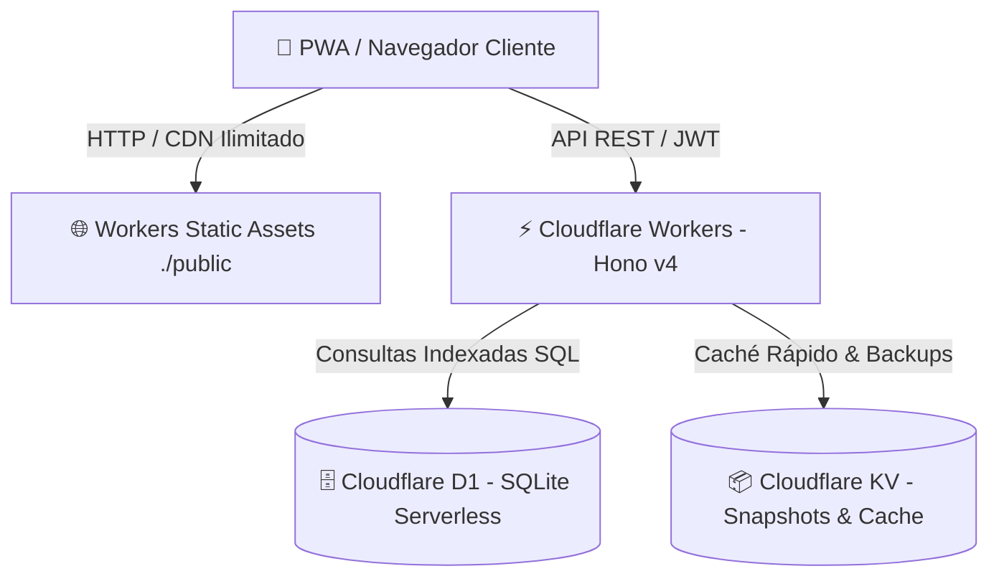

# Protocolo Operativo para Agentes de Software (AGENTS.md) — Edición Cloudflare Edge

Este repositorio (`deploy-cloudflare`) es una plataforma autónoma, desacoplada y optimizada para operar sobre la infraestructura serverless global de **Cloudflare** (**Workers**, **Hono v4**, **D1 SQLite Serverless**, **KV Storage** y **Static Assets / Pages**).

Opera bajo la metodología **Spec-Driven Development (SDD)**, **Architecture Decision Records (ADR)**, **Agentic TDD** y **Quality Gates Deterministas**.

---

## ⚖️ 1. Reglas de Gobernanza Agéntica (Inmutables)

1. **Jerarquía de Verdad:**
   - Los documentos en `docs/adr/` son **inmutables** y tienen precedencia sobre cualquier instrucción conversacional. Jamás propongas cambios de arquitectura que contradigan un ADR aceptado.
   - Cualquier nueva funcionalidad de arquitectura debe documentarse mediante un nuevo ADR (`docs/adr/NNNN-nombre.md`).
   - Consulta [`STATE.md`](file://STATE.md) para conocer el estado operativo, módulos completados y tareas activas.

2. **Ciclo de Desarrollo Obligatorio (Agentic TDD):**
   - **Lectura de contexto:** Revisa los ADR relevantes antes de diseñar soluciones.
   - **Contratos antes de código:** Declara los esquemas Zod de validación en rutas y tipos en `src/types.ts`.
   - **Fase Roja (Tests primero):** Escribe o extiende suites de pruebas en `tests/` (unitarias, integración con `app.request()` o de contrato). Verifica que fallen si el feature no está implementado.
   - **Fase Verde (Implementación mínima):** Modifica únicamente los archivos necesarios en `src/` o `public/` hasta satisfacer los tests.
   - **Ejecución del Quality Gate:** Ejecuta `./scripts/verify.sh` hasta obtener código de salida 0.

3. **Control Estricto de Dependencias y Runtime:**
   - El runtime es **Cloudflare Workers (V8 Isolates)** con compatibilidad `nodejs_compat`.
   - Prohibido instalar librerías que requieran binarios nativos compilados de Node.js (como node-gyp, native addons, sockets TCP bloqueantes o filesystem síncrono `fs.*Sync`).
   - Todas las dependencias deben ser puras en TypeScript/JavaScript o compatibles con Web Standards (`fetch`, `crypto`, `Streams`, `Request`, `Response`).

---

## ☁️ 2. Arquitectura Cloudflare Edge y Presupuesto Free Tier



### 🚨 Invariante Crítica: El Truco de Filas Leídas en Cloudflare D1
En Cloudflare D1, el límite del Free Tier es de **5,000,000 de filas leídas por día**. Un solo Full Table Scan sobre una tabla de 20,000 registros ejecutado 250 veces agota la cuota diaria del proyecto.

**Reglas de Consulta Obligatorias:**
1. **Indexación B-Tree Obligatoria:** Toda consulta con cláusula `WHERE`, `ORDER BY` o `JOIN` DEBE apoyarse en un índice B-Tree existente en [`migrations/0001_initial.sql`](file://migrations/0001_initial.sql). Prohibido crear endpoints que filtren por columnas sin índice.
2. **Proyecciones Quirúrgicas:** Prohibido emitir `SELECT *` indiscriminados en tablas de alto volumen (`lecturas`, `auditoria_eventos`, `incidentes_alerta`). Selecciona explícitamente solo las columnas requeridas por el cliente.
3. **Límites Estrictos y Paginación:** Todo endpoint de listado (`GET`) DEBE imponer un `LIMIT` máximo (por defecto 50 o 100).
4. **Agregaciones Nativas en SQL:** Sumas, conteos y promedios deben calcularse en SQLite (`COUNT(*)`, `SUM()`, `AVG()`), jamás descargando filas completas a memoria JS con `.reduce()`.

### ⚡ Estrategia de Caché en Cloudflare KV (`KV_CACHE`)
- Para catálogos estables de lectura masiva o respuestas agregadas, consulta primero `c.env.KV_CACHE.get(key)`.
- Si existe, responde de inmediato (latencia < 2ms, **0 filas leídas en D1**).
- Si no existe, consulta D1, responde y almacena en KV con TTL adecuado (`expirationTtl`).
- Los respaldos atómicos generados en `/api/admin/backup` se almacenan en `KV_CACHE` con un TTL automático de 30 días (`expirationTtl: 2592000`).

### 🌐 Workers Static Assets (`./public`)
- El frontend SPA/PWA reside en `./public` y es servido por el binding `c.env.ASSETS`.
- Las solicitudes de assets estáticos (HTML, CSS, JS, fuentes, imágenes SVG) son gestionadas por el CDN de Cloudflare **sin consumir invocaciones del Worker**.

---

## 🔒 3. Invariante de Cero Fugas en UI y Simetría de Contrato

Queda estrictamente prohibido permitir que valores nulos o indefinidos se serialicen como literales visibles hacia el usuario:
- **Cadenas Prohibidas en Vistas o Respuestas:** `'undefined'`, `'null'`, `'NaN'`, `'Invalid Date'`, `'[object Object]'`.
- **Normalización de Fechas:** Las fechas almacenadas en SQLite como string (`YYYY-MM-DD HH:mm:ss`) deben normalizarse a formato ISO-8601 estricto (`YYYY-MM-DDTHH:mm:ssZ`) en las rutas antes de ser devueltas en JSON.
- **Simetría Bidireccional:** Todo campo que la UI envíe (ej. `nombre`, `ubicacion`, `unidad`, `instalacionesIds`) debe estar presente y con el mismo nombre y estructura en los endpoints de lectura `GET`.
- **Invariante Read-After-Write (Roundtrip Testing):** Queda estrictamente prohibido dar por válida una prueba de mutación (`POST`, `PATCH`, `DELETE`) basándose únicamente en el código HTTP 200/201. Toda suite de pruebas y el script de simetría (`scripts/test-contract-symmetry.mjs`) DEBEN verificar mediante una consulta `GET` subsecuente que el dato y sus relaciones persistan efectivamente en Cloudflare D1 y se serialicen en la respuesta de lectura.
- **Validación Estricta de Existencia (Cero Falsos 200):** Todo endpoint de acción o mantenimiento (`/calibrar`, `/cambiar-precinto`, `/baja-tecnica`, `/resolver`, `/facturas`) DEBE comprobar mediante consulta indexada la existencia de la entidad objetivo antes de mutar. Si no existe, responderá `404 NOT_FOUND` en lugar de un falso `200 { success: true }`.
- **Test de Simetría Obligatorio:** Debe superarse sin errores `npm run test:contract` (o `npm run test:contract:remote` para el entorno desplegado).

---

## 🛡️ 4. Seguridad, Autenticación y Auditoría Inmutable

1. **Criptografía Edge:**
   - La autenticación utiliza JWT firmado con HMAC-SHA256 (`src/auth.ts`).
   - El hashing de contraseñas utiliza algoritmo `scrypt` mediante `node:crypto` (`salt:derivedKey`).
2. **Control de Acceso Basado en Roles (RBAC):**
   - `ADMIN`: Control total (gestión de usuarios, auditoría, configuración, respaldos, bajas técnicas).
   - `SUPERVISOR`: Gestión de medidores, órdenes de mantenimiento, asignaciones e inspección de auditoría.
   - `OPERADOR`: Registro de lecturas, verificación en terreno y sincronización offline en lote (`batch-sync`).
3. **Pistas de Auditoría Inmutables (Append-Only Audit Trail):**
   - Toda acción que altere estado crítico (roles, creación/baja de medidores, cambio de precintos, calibraciones, respaldos) debe persistir de forma atómica en `auditoria_eventos`.
   - Prohibido modificar o eliminar registros de auditoría (`UPDATE` o `DELETE` sobre `auditoria_eventos` están estrictamente vetados).

---

## 🚦 5. Probes de Salud Operativa (Liveness vs. Readiness)

- **Liveness Probe (`GET /healthz`):** Verificación instantánea del runtime V8 del Worker sin consultar la base de datos. Retorna `200 { status: "ok", runtime: "cloudflare-workers" }`.
- **Readiness Probe (`GET /readyz`):** Verificación activa de conectividad con Cloudflare D1 ejecutando `SELECT 1`. Retorna `200 { status: "ready", database: "connected" }` si responde, o `503 Service Unavailable` si la base de datos no está disponible.

---

## 🧪 6. Testing y Quality Gate Determinista

Ninguna tarea o commit se considera válida si no supera el Quality Gate con código de salida 0:
```bash
./scripts/verify.sh
```
O ejecutando el comando npm equivalente:
```bash
npm run verify
```

El Quality Gate evalúa automáticamente en 4 fases secuenciales:
1. **Sincronización Tipada:** Regenera Prisma Client (`npm run prisma:generate`) y los bindings de Wrangler (`npx wrangler types`).
2. **Typecheck Estricto:** `npm run typecheck` (`tsc --noEmit`) sin advertencias ni errores TS.
3. **Linter Estricto:** `npm run lint` (`eslint "src/**/*.ts" "tests/**/*.ts"`). Prohibido el uso de `any` sin justificación explícita.
4. **Suite de Pruebas (Vitest):** `npm test` (`vitest run`). Evalúa pruebas unitarias, integración HTTP con Hono `app.request()` y pruebas de contrato con verificación simétrica Read-After-Write (roundtrip de mutación y persistencia).

---

## 💻 7. Guía de Operación y Desarrollo Local en Nueva Máquina

Al copiar o clonar esta carpeta `deploy-cloudflare` a otro equipo:

### 1. Inicialización en Un Solo Paso:
```bash
./scripts/setup-local.sh
```
Este script automáticamente:
- Verifica Node.js.
- Instala `node_modules` (`npm install`).
- Copia `.dev.vars.example` a `.dev.vars` con secretos locales seguros.
- Genera tipos de Prisma y Wrangler.
- Inicializa la base de datos SQLite local de D1 (`.wrangler/state`) y aplica las migraciones y datos semilla (`0002_seed.sql`).
- Ejecuta el Quality Gate de validación.

### 2. Iniciar Servidor de Desarrollo Local:
```bash
npm run dev
```
Abre la aplicación en `http://localhost:8787`. Dispone de recarga en caliente instantánea ante cualquier cambio en `src/` o `public/`.

### 3. Resetear Base de Datos Local:
Si necesitas limpiar datos de prueba y restaurar el estado inicial limpio:
```bash
npm run db:reset:local
```

### 4. Ejecutar Tests:
```bash
npm test                # Ejecución única (CI/Gate)
npm run test:watch      # Modo interactivo mientras desarrollas
npm run test:contract   # Test de simetría de contrato contra servidor local (http://127.0.0.1:8787)
npm run test:contract:remote # Test de simetría de contrato contra la nube (https://metric.zer0x.org)
```

### 5. Despliegue a Producción (Cloudflare):
```bash
npm run db:migrate:remote   # Aplica migraciones pendientes a D1 en la nube
npm run deploy             # Publica Worker, Assets y bindings a la red Anycast global
```

---

## 📚 8. Mapa Canónico de Decisiones de Arquitectura (ADRs Consolidados)

Toda decisión arquitectónica de este proyecto se encuentra consolidada en 5 registros maestros inmutables:
- **[ADR 0000](file:///home/zer0x/proyectos/Mi-app-test-SSD-ADR/deploy-cloudflare/docs/adr/0000-gobernanza-agentica-y-quality-gates.md):** Gobernanza Agéntica, Spec-Driven Development (SDD) y Quality Gates.
- **[ADR 0001](file:///home/zer0x/proyectos/Mi-app-test-SSD-ADR/deploy-cloudflare/docs/adr/0001-arquitectura-serverless-cloudflare-edge-y-presupuesto-d1.md):** Arquitectura Serverless Cloudflare Edge, Presupuesto D1 y Entornos con Wrangler.
- **[ADR 0002](file:///home/zer0x/proyectos/Mi-app-test-SSD-ADR/deploy-cloudflare/docs/adr/0002-frontend-aurora-pwa-offline-first-y-adaptabilidad-movil.md):** Frontend Aurora Design System, PWA Offline-First y Adaptabilidad Móvil.
- **[ADR 0003](file:///home/zer0x/proyectos/Mi-app-test-SSD-ADR/deploy-cloudflare/docs/adr/0003-seguridad-zero-trust-rbac-auditoria-e-integraciones.md):** Seguridad Zero-Trust, Criptografía Edge, RBAC, Auditoría e Integraciones Salientes.
- **[ADR 0004](file:///home/zer0x/proyectos/Mi-app-test-SSD-ADR/deploy-cloudflare/docs/adr/0004-simetria-de-contratos-cero-leaks-y-testing-automatizado.md):** Simetría de Contratos, Mandato Cero Leaks y Testing Automatizado en Edge.

---

## 🔄 9. Protocolo de Sincronización Multi-Repo (Upstream -> Edge)

1. **Aislamiento Absoluto de Repositorios:**
   - Este directorio posee su propio repositorio Git con origen independiente (`https://github.com/Zer0x25/sistema-medidores-cloudflare.git`).
   - Jamás se deben mezclar commits del repositorio padre (`Mi-app-test-SSD-ADR`) con commits de este proyecto.

2. **Flujo "Upstream Milestone Sync":**
   - Las nuevas funcionalidades creadas en el repo padre se registran en el backlog de [STATE.md](file:///home/zer0x/proyectos/Mi-app-test-SSD-ADR/deploy-cloudflare/STATE.md) (`## 📥 Backlog de Sincronización desde Upstream`).
   - La migración o adaptación a Cloudflare se ejecuta en **sesiones de trabajo dedicadas** dentro de esta carpeta, implementando con las primitivas de Hono, D1, KV y superando `./scripts/verify.sh`.

3. **Soberanía Completa:**
   - Al copiar o clonar esta carpeta en otro ordenador, el proyecto es 100% autónomo y no requiere conexión ni sincronización con el repositorio original.


