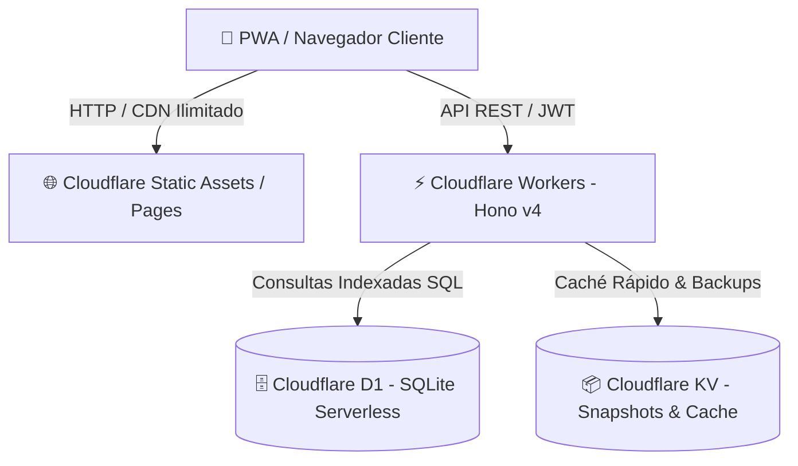

# ☁️ Sistema Medidores — Cloudflare Workers, D1, KV & Static Assets
> **Arquitectura Edge-Native optimizada 100% para el Nivel Gratuito (Cloudflare Free Tier)**

Este proyecto es una plataforma completa, autónoma y de alto rendimiento para la gestión, auditoría y monitoreo metrológico de medidores de energía y fluidos. Ha sido concebida desde el primer día para ejecutarse en la infraestructura global de **Cloudflare**, combinando **Pages/Static Assets**, **Workers**, **D1 (SQLite Serverless)** y **KV (Key-Value Storage)** para operar a escala con **costo $0 USD**.

---

## 🏗️ Arquitectura Serverless Multi-Producto



1. **Cloudflare Static Assets / Pages (`./public`)**:
   - Aloja la Single Page Application (SPA) y Service Worker (PWA).
   - **Ventaja Free Tier**: Las peticiones de assets estáticos (HTML, CSS, JS, SVG, iconos) son **ilimitadas y gratuitas** en la red Anycast de Cloudflare, **sin consumir la cuota diaria de 100,000 invocaciones del Worker**.

2. **Cloudflare Workers (`src/index.ts` con Hono v4)**:
   - Procesa la lógica de negocio, autenticación JWT, RBAC y validaciones Zod.
   - Ejecutado en V8 Isolates ultra-ligeros con tiempo de arranque en frío prácticamente nulo (< 5ms).

3. **Cloudflare D1 (`sistema-medidores-db`)**:
   - Base de datos relacional serverless basada en SQLite.
   - Almacena el modelo relacional transaccional: sedes, medidores, lecturas, incidentes de alerta, órdenes de mantenimiento y bitácora inmutable de auditoría.

4. **Cloudflare KV (`KV_CACHE`)**:
   - Almacén clave-valor distribuido en memoria de ultra-baja latencia.
   - **Data Caching**: Respuestas agregadas de lectura frecuente (KPIs consolidados, catálogos estables) para evitar pegarle a la base de datos relacional.
   - **Snapshots & Backups**: Los respaldos atómicos generados desde `/api/admin/backup` se almacenan como snapshots inmutables con TTL automático de retención (30 días).

---

## 📊 Presupuesto y Límites del Cloudflare Free Tier

El sistema está estrictamente dimensionado para operar con holgura dentro de las cuotas gratuitas diarias de Cloudflare:

| Recurso | Límite Gratuito Diario (Free Tier) | Uso en este Proyecto | Estrategia de Protección |
| :--- | :--- | :--- | :--- |
| **Workers Invocations** | **100,000 requests / día** | Solo peticiones dinámicas `/api/*` | SPA y assets servidos por CDN sin invocar Worker |
| **Workers CPU Time** | **10 ms de CPU por request** | Promedio de 2 a 8 ms de CPU | Hono ultraligero y consultas D1 no bloqueantes |
| **D1 Filas Leídas** | **5,000,000 filas leídas / día** | Minimizadas mediante índices B-Tree | 💡 *El truco de consulta inteligente* (ver abajo) |
| **D1 Filas Escritas** | **100,000 filas escritas / día** | Solo altas, lecturas y eventos reales | Batch sync de lecturas y transacciones agrupadas |
| **D1 Almacenamiento** | **5 GB por base de datos** | < 100 MB para miles de medidores | Esquemas normalizados y tipos compactos |
| **KV Lecturas** | **100,000 lecturas / día** | Caching de alta demanda | Lecturas en edge directo en < 2 ms |
| **KV Escrituras** | **1,000 escrituras / día** | Backups y rotación de métricas | Solo escrituras programadas o manuales |
| **KV Almacenamiento** | **1 GB total** | < 50 MB para respaldos | TTL de expiración automática de 30 días |

---

## 💡 El Truco Maestro: Cómo no Agotar la Base de Datos D1

### ⚠️ La Trampa Oculta de Cloudflare D1
En Cloudflare D1, el cobro y las cuotas del Free Tier **no se miden únicamente por cantidad de consultas SQL ejecutadas**, sino por **Filas Leídas (Rows Read)**.

> **Ejemplo del error común:**
> Si tu tabla de `lecturas` tiene 20,000 registros y escribes:
> ```sql
> -- ❌ GRAVE ERROR: Full Table Scan
> SELECT * FROM lecturas WHERE medidorId = 'med-01';
> ```
> Si `medidorId` no tiene índice, SQLite escanea las **20,000 filas**.
> Si 250 usuarios abren el dashboard durante el día:  
> `250 × 20,000 = 5,000,000 filas leídas`.  
> **¡Tu cuota de todo el día se agotó en minutos y la base de datos se bloquea!**

### ✅ Las Reglas de Optimización Aplicadas en este Proyecto

1. **Indexación Compuesta Obligatoria (B-Tree Scans)**:
   Todas las tablas tienen índices estratégicos en [`migrations/0001_initial.sql`](file:///home/zer0x/proyectos/Mi-app-test-SSD-ADR/deploy-cloudflare/migrations/0001_initial.sql):
   - `CREATE INDEX idx_lecturas_medidor_fecha ON lecturas(medidorId, fecha DESC);`
   - `CREATE INDEX idx_medidores_instalacion_activo ON medidores(instalacionId, activo);`
   - `CREATE INDEX idx_alertas_estado ON incidentes_alerta(estado, fechaDeteccion DESC);`
   *Resultado:* La consulta busca directamente en el árbol B-Tree y **solo lee 1 fila en lugar de 20,000**.

2. **Proyecciones Quirúrgicas (Cero `SELECT *` Innecesarios)**:
   Se seleccionan exclusivamente los campos que la vista necesita:
   ```sql
   -- ✅ Óptimo: Solo 3 columnas, lee solo el nodo de índice
   SELECT id, codigo, lecturaActual FROM medidores WHERE instalacionId = ? LIMIT 50;
   ```

3. **Límites Estrictos y Paginación Cursor / Offset**:
   Ningún endpoint de listado permite consultas abiertas sin tope. Rutas como `/api/auditoria`, `/api/webhooks/entregas` y `/api/lecturas` imponen `LIMIT 50` o `LIMIT 100` por diseño.

4. **Agregaciones Nativas en Motor SQL**:
   En lugar de descargar miles de lecturas a JavaScript para sumar consumos con `.reduce()`, se utiliza agregación en SQLite:
   ```sql
   SELECT SUM(consumoPeriodo) as total, COUNT(*) as cantidad FROM lecturas WHERE ...;
   ```

5. **Caché en Edge con Cloudflare KV (`KV_CACHE`)**:
   Para datos de alto tráfico (catálogos de sedes o snapshots de KPIs), la respuesta puede resolverse en memoria KV en el POP más cercano al usuario. Costo a D1: **0 filas leídas**.

6. **Estrategia de Backup sin Sobrecarga Relacional**:
   El endpoint de respaldo (`POST /api/admin/backup`) no crea tablas pesadas duplicadas en D1. Genera un snapshot inmutable registrado en la bitácora de auditoría y respalda el payload en Cloudflare KV con un TTL de 30 días (`expirationTtl: 2592000`), limpiándose automáticamente sin intervención humana.

---

## 🚀 Puesta en Marcha Local (100% Offline con Wrangler)

Miniflare emula Workers, D1 SQLite y KV localmente sin necesidad de internet ni cuenta activa de Cloudflare.

### 1. Instalación
```bash
cd deploy-cloudflare
npm install
```

### 2. Inicializar base de datos local D1
```bash
# Aplica el esquema relacional con índices
npm run db:migrate:local

# Inserta la semilla inicial con usuarios, sedes y reglas
npm run db:seed:local
```

### 3. Iniciar el entorno de desarrollo
```bash
npm run dev
```
La aplicación estará disponible inmediatamente en `http://localhost:8787/`.

---

## 🔑 Credenciales Demo Preconfiguradas

| Rol | Correo | Contraseña | Perfil y Alcance |
| :--- | :--- | :--- | :--- |
| **ADMIN** | `admin@medidores.cl` | `demo1234` | Control global, auditoría, usuarios, webhooks y respaldos |
| **SUPERVISOR** | `supervisor@medidores.cl` | `demo1234` | Visualización de dashboard, métricas, alertas y reportes |
| **OPERADOR** | `operador@medidores.cl` | `demo1234` | Modo Terreno, captura de lecturas y sincronización PWA |

---

## 🧪 Pruebas Automatizadas E2E (Playwright)

El proyecto cuenta con **100% de paridad y cobertura** en 17 suites de prueba Playwright (44 tests verificados contra el runtime local):

```bash
# Ejecutar toda la suite E2E contra el puerto 8787 de Cloudflare Workers
BASE_URL=http://localhost:8787 npx playwright test --workers=1
```

Suites cubiertas:
- Autenticación JWT y RBAC (`login-pantalla-real.spec.ts`, `login-rbac.spec.ts`)
- Catálogo y Aprovisionamiento (`catalogo-aprovisionamiento.spec.ts`)
- Captura de Lecturas y Validación Decreciente (`lecturas-terreno.spec.ts`)
- Resiliencia Offline y PWA Background Sync (`pwa-offline-resiliencia.spec.ts`)
- Motor de Alertas e Incidentes en Tiempo Real (`alertas-incidentes.spec.ts`)
- Mantenimiento y Ciclo Metrológico (`mantenimiento-ciclo-vida.spec.ts`, `mantenimiento-metrologico.spec.ts`)
- Conciliación y Facturación (`reportes-conciliacion.spec.ts`)
- Bitácora Inmutable y Respaldo Atómico (`auditoria-backup.spec.ts`)
- Webhooks con Firmas HMAC-SHA256 (`webhooks-administracion.spec.ts`)
- Diseño Responsivo y Fichas Táctiles (`responsive-mobile.spec.ts`, `responsive-mobile-cards.spec.ts`)

---

## ☁️ Despliegue en Cloudflare (Producción Free Tier)

Sigue estos pasos para publicar tu aplicación en la infraestructura global gratuita de Cloudflare:

### Paso 1: Autenticar Wrangler
```bash
npx wrangler login
```

### Paso 2: Crear la base de datos D1 en la nube
```bash
npx wrangler d1 create sistema-medidores-db
```
*Wrangler te devolverá un `database_id` (UUID). Cópialo y pégalo en tu [`wrangler.jsonc`](file:///home/zer0x/proyectos/Mi-app-test-SSD-ADR/deploy-cloudflare/wrangler.jsonc):*
```jsonc
"d1_databases": [
  {
    "binding": "DB",
    "database_name": "sistema-medidores-db",
    "database_id": "<tu-database-id-de-cloudflare>",
    "migrations_dir": "migrations"
  }
]
```

### Paso 3: Crear el Namespace de KV en la nube
```bash
npx wrangler kv:namespace create KV_CACHE
```
*Copia el `id` retornado y actualízalo en [`wrangler.jsonc`](file:///home/zer0x/proyectos/Mi-app-test-SSD-ADR/deploy-cloudflare/wrangler.jsonc):*
```jsonc
"kv_namespaces": [
  {
    "binding": "KV_CACHE",
    "id": "<tu-kv-namespace-id>"
  }
]
```

### Paso 4: Ejecutar migraciones en la nube
```bash
npm run db:migrate:remote
```

### Paso 5 (Opcional): Cargar datos semilla en producción
```bash
npx wrangler d1 execute sistema-medidores-db --remote --file=./migrations/0002_seed.sql
```

### Paso 6: Desplegar Worker y Frontend
```bash
npm run deploy
```

Cloudflare te asignará una URL con HTTPS y CDN global automático:
`https://sistema-medidores-edge.<tu-subdominio>.workers.dev`

---

## 📈 Monitoreo de Cuotas en Producción

Puedes auditar el consumo de recursos de tu Free Tier en cualquier momento:
1. **Cloudflare Dashboard**: Ve a **Workers & Pages** > Selecciona tu Worker > pestaña **Metrics**.
2. **D1 Analytics**: Monitorea **Rows Read** y **Rows Written** para verificar que tus consultas se mantengan en los rangos mínimos esperados.
3. **Métricas en Navegador (`Server-Timing`)**: Cada petición devuelve encabezados `Server-Timing` visibles en DevTools (F12 > Network > Timing) para inspeccionar la latencia exacta de cada endpoint.
