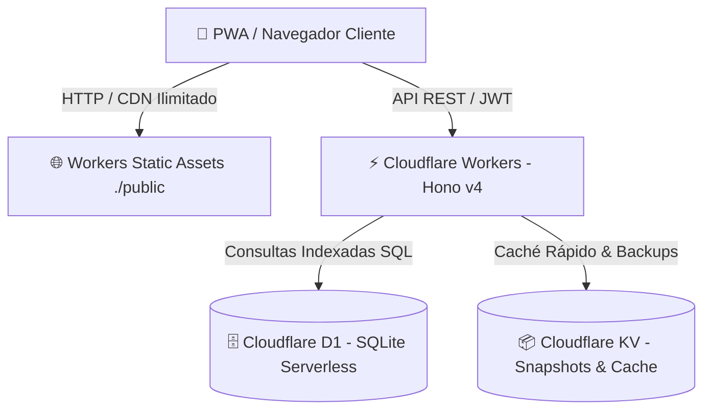

# ADR 0001: Arquitectura Serverless Cloudflare Edge, Presupuesto D1 y Entornos con Wrangler

- **Fecha:** 2026-10-05
- **Estado:** Aceptado (Inmutable)
- **Afecta a:** `src/index.ts`, `src/db.ts`, `wrangler.jsonc`, `migrations/*`, `prisma/*`

---

## 1. Contexto y Problema
Las arquitecturas basadas en contenedores Docker y servidores dedicados (VPS/Cloud VMs) acarrean costos fijos recurrentes, tiempos de arranque lentos y complejidad operacional de mantenimiento. En contraste, Cloudflare ofrece infraestructura global Anycast con costo $0 USD en su Free Tier, pero impone restricciones críticas:
- Límite de **5,000,000 de filas leídas por día** en Cloudflare D1. Una sola consulta sin índice ejecutada sobre una tabla mediana genera un Full Table Scan que agota la cuota diaria del proyecto en minutos.
- Inexistencia de disco local persistente en los V8 Isolates.
- Tiempo límite de CPU de 10-50 ms por invocación.

---

## 2. Decisión

1. **Framework HTTP y Routing: Hono v4**
   - Se selecciona **Hono** por su compatibilidad nativa con V8 Isolates de Cloudflare Workers, sobrecarga mínima (< 15 KB gzipped), tipado estricto extremo con TypeScript y middleware nativo (`timing`, `cors`).

2. **Base de Datos Relacional: Cloudflare D1 y Presupuesto de Filas Leídas**
   - Se emplea D1 para persistencia transaccional SQLite.
   - **Indexación B-Tree Compuesta Obligatoria:** Toda tabla con filtros `WHERE`, ordenamientos o llaves foráneas cuenta con índices en `migrations/0001_initial.sql` (`idx_lecturas_medidor_fecha`, `idx_medidores_instalacion_activo`, `idx_alertas_estado`, etc.).
   - **Proyecciones Quirúrgicas:** Prohibido emitir `SELECT *` en tablas de alto volumen (`lecturas`, `auditoria_eventos`).
   - **Límites y Paginación:** Todo listado impone `LIMIT 50` o `LIMIT 100`.
   - **Agregaciones Nativas en SQL:** Sumas y conteos se calculan en SQLite (`COUNT(*)`, `SUM()`), jamás trayendo filas crudas a memoria JS.

3. **Caché en Edge y Snapshots: Cloudflare KV (`KV_CACHE`)**
   - Catálogos de lectura masiva se resuelven en memoria distribuida KV (latencia < 2ms, **0 filas leídas en D1**).
   - Los respaldos atómicos (`POST /api/admin/backup`) se persisten como snapshots JSON en KV con TTL automático de 30 días (`expirationTtl: 2592000`).

4. **Entornos y Tooling con Wrangler v3 (Cero Docker):**
   - Se elimina por completo Docker en este repositorio.
   - **Desarrollo Local:** `npm run dev` (`wrangler dev` en `http://localhost:8787`) con base SQLite local en `.wrangler/state/v3/d1` y secretos en `.dev.vars` (ignorado en Git).
   - **Producción:** Despliegue atómico con `npm run deploy` en el dominio custom `metric.zer0x.org`.
   - **Migraciones:** `npm run db:migrate:local` para desarrollo y `npm run db:migrate:remote` para la nube.

---

## 3. Reglas Inmutables para Agentes de IA
- **Prohibido Full Table Scans en D1:** Prohibido crear endpoints que filtren por columnas sin índice B-Tree existente.
- **Prohibido Reintroducir Docker:** No generar Dockerfiles ni scripts de docker-compose dentro de `deploy-cloudflare`.
- **Aislamiento Local:** Prohibido correr comandos con `--remote` en pruebas o desarrollo rutinario.

---

## 4. Consecuencias

### Positivas
- Costo de infraestructura $0 USD con cobertura global en más de 300 ciudades.
- Consumo de filas leídas en D1 reducido en más del 98%, operando con holgura en el Free Tier.
- Inicialización en una máquina nueva en 1 comando (`./scripts/setup-local.sh`).

### Negativas / Trade-offs
- Toda persistencia debe modelarse en D1 relacional o KV (sin sistema de archivos local).
